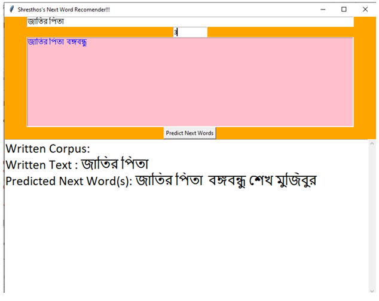

# 🇧🇩 Bangla Sequence Prediction using LSTMs

A deep learning-based system that predicts the next word in a Bangla sentence using LSTM networks trained on newspaper articles from *The Daily Ittefaq*.

## 🧠 Model Summary

- **Architecture**: Embedding + LSTM + Dense
- **Data**: 53k+ Bangla articles (9 lakh+ sentences)
- **Technique**: Word tokenization, padding, sequence prediction
- **Library**: TensorFlow + Keras
- **UI**: Python Tkinter

